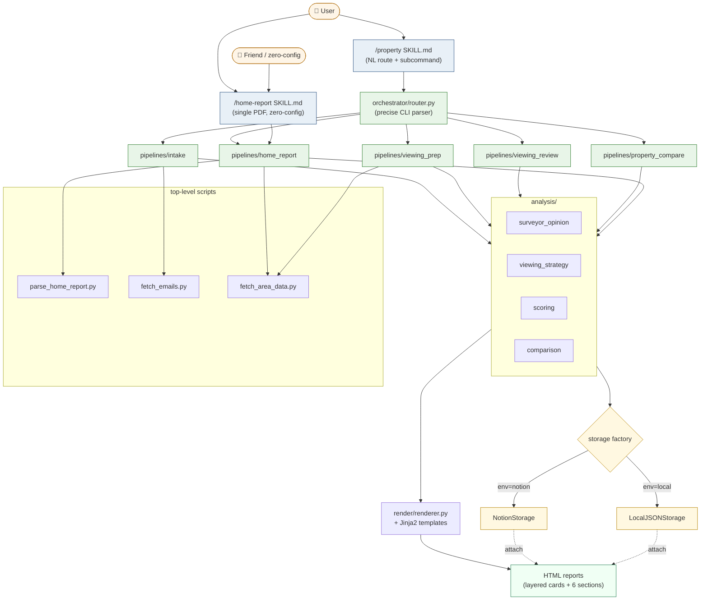

# Scottish Property Assistant

苏格兰房产分析与跟踪。一个可分享的 Claude Code skill 集，把 Home Report PDF 翻译成你能读得懂、能据此出价的分析报告。

```
/home-report ~/Downloads/your_home_report.pdf
```

→ 输出 HTML 分析报告（含资深评估师专业意见的三层卡片视图、维多利亚 Tenement / Pre-1919 苏格兰房产专属判断、出价建议、看房问题清单）。

**零配置**：不需要 Notion、不需要 Gmail、不需要 Google Maps API key。

---

## 两个命令

### `/home-report path.pdf`
**零配置单 PDF 入口**。给一份 Home Report PDF，得到一份 HTML 分析。数据存到 `~/.property_data/`。朋友拿到能立刻跑。

### `/property`
**完整工作流**（需要 Notion + Gmail 才能跑全套；任何缺失都自动降级）。

```bash
/property                          # 默认：扫邮件 + 列待办（dry-run）
/property --apply                  # 真执行：写沟通记录、更新看房时间等

/property prep --addr <X> ...      # 单房看房简报
/property prep --weekend           # 本周末所有看房
/property review                   # 已看房源复盘 + gap 分析
/property compare --addr A --addr B [...]  # 横向对比
/property analyze <PDF>            # = /home-report
/property emails --hours 72        # 仅跑 email intake
/property health                   # 连通性检查
```

也接受自然语言（"下周末看房" → `prep --weekend`，"复盘上周" → `review`），Claude 在 SKILL.md 里做意图识别。

---

## 架构



<details>
<summary>ASCII fallback（不支持 mermaid 的 markdown viewer）</summary>

```
                 ┌──────────────┐         ┌──────────────────┐
   user ────────▶│ /property    │         │ /home-report PDF │  user (or friend)
                 │  (SKILL.md)  │         │   (SKILL.md)     │
                 └──────┬───────┘         └────────┬─────────┘
                        │ subcommand parse +       │
                        │ NL route                 │
                        ▼                          │
                ┌───────────────┐                  │
                │ orchestrator/ │                  │
                │   router.py   │                  │
                └───────┬───────┘                  │
       ┌────────┬───────┼────────┬──────────┐     │
       ▼        ▼       ▼        ▼          ▼     ▼
   intake   viewing  viewing  property   home_report
            _prep    _review  _compare
       │        │       │        │          │
       └────────┴───┬───┴────────┴──────────┘
                    ▼
   ┌────────────┬─────────────┬──────────────┐
   │  parsers/  │  analysis/  │   render/    │
   │ parse_home │ scoring     │ renderer +   │
   │ fetch_email│ surveyor_op │ Jinja2       │
   │            │ viewing_str │ templates    │
   │            │ comparison  │ (_base +     │
   │            │             │  per-kind)   │
   └────────────┴──────┬──────┴──────────────┘
                       ▼
                ┌──────────────┐
                │   storage/   │  ← .env STORAGE_BACKEND 决定
                │  base.py     │
                ├──────────────┤
                │ NotionStorage│ ← 用户自己
                │ LocalJSON-   │ ← 朋友默认
                │   Storage    │
                └──────────────┘
```
</details>

### Data flow: 单 PDF 一条线（`/home-report path.pdf`）

```mermaid
sequenceDiagram
  participant U as User
  participant S as SKILL.md (Claude)
  participant P as parse_home_report.py
  participant L as LLM (Claude in same turn)
  participant V as validator CLI
  participant Pipe as home_report pipeline
  participant ST as Storage

  U->>S: /home-report ~/x.pdf
  S->>P: subprocess parse PDF
  P-->>S: parsed.json (22 fields + condition table + contradictions)
  S->>L: generate SurveyorOpinion JSON<br/>(grounded in parsed.json)
  L-->>S: opinion.json
  S->>V: validate --parsed --opinion
  V-->>S: ok (or errors; retry 1x)
  S->>Pipe: run(pdf, opinion, parsed)
  Pipe->>Pipe: compute score (7 dimensions)
  Pipe->>Pipe: render layered-cards HTML
  Pipe->>ST: upsert + attach_html_report
  Pipe-->>U: ✓ HTML path + summary
```

[`docs/INSTALL.md`](docs/INSTALL.md) 有详细安装步骤；[`docs/INTEGRATIONS.md`](docs/INTEGRATIONS.md) 是各集成（Notion / Gmail / Google Maps）的可选配置。

---

## 安装

```bash
git clone <repo-url> ~/.claude/property_assistant
cd ~/.claude/property_assistant
pip install -r requirements.txt
cp .env.example .env       # 默认 STORAGE_BACKEND=local，无需任何 token
```

把两个 SKILL 软链到 Claude commands 目录：
```bash
mkdir -p ~/.claude/commands
ln -s $(pwd)/skills/home-report.md ~/.claude/commands/home-report.md
ln -s $(pwd)/skills/property.md    ~/.claude/commands/property.md
```

然后在 Claude Code 里：
```
/home-report ~/Downloads/some_home_report.pdf
```

---

## 关键概念

### `SurveyorOpinion` 强类型契约
评估师意见不是自由文本，而是 6+1 段结构化数据：

| 段 | 内容 | 强制 |
|---|---|---|
| ① 整体定位 | 一句话定性 | ✓ |
| ② 评分校正 | 机械评分被冤枉的地方（cat_notes_contradictions 必须逐条点名） | 条件 |
| ③ 真正的关注点 | ≤5 条最值得警惕 | — |
| ④ 估值判断 | HR 估价 vs 市场对标 | ✓ |
| ⑤ 出价方向 | 1-3 条建议 | ✓ |
| ⑥ 看房当日 3 个最关键问题 | 1-5 条 | ✓ |
| ⑦ 💭 评估师的额外思考 | 随手观察 / 历史经验 | 可选 |

每条 Finding 有 `kind` (fact / judgment / assumption) + `text` + 可选 `rationale` / `quote` / `evidence_page`。Validator 强制：
- `cat_notes_contradictions` 全部要被 `score_corrections` 覆盖
- `fact` 必须有 evidence_page
- 整篇 judgment 类至少 3 条（防止纯事实堆砌）

### HTML 三层卡片
- 📋 客观事实（蓝） — PDF 里黑白纸字的东西
- 🎓 评估师判断（绿） — 推断/建议
- ⚠️ 假设与未知（黄） — 不全信息

下面是详细 6 段视图、评分校正可视化（机械分 → 评估师调整后）、Cat 表、区域情报、HR 速览、嵌入式 Google Maps。

### Storage 抽象
- `NotionStorage` —— 直连你 Notion DB「房源追踪」，34 个字段（中文 property 名）自动映射
- `LocalJSONStorage` —— 零配置，数据存 `~/.property_data/`（朋友默认）

切换：`.env` 里改 `STORAGE_BACKEND=notion|local`。

---

## 数据存哪里

| Backend | 数据位置 | 报告位置 |
|---|---|---|
| `local` (默认) | `~/.property_data/properties/<slug>.json` | `~/.property_data/reports/<slug>/<timestamp>_<kind>.html` |
| `notion` | Notion DB「房源追踪」(每行一套房) | `HTML报告` URL 字段（链 file:// 本地路径）+ 顶部 callout 摘要 |

---

## 测试

```bash
./run_tests.sh                          # 全套（含 storage 单测、validator 测、模板渲染测）
NOTION_PARITY_TEST=1 ./run_tests.sh     # 加跑活 Notion round-trip（会创建 + 归档一个测试 page）
```

143+ 单测覆盖：PropertyRecord coercion、Notion field map、SurveyorOpinion validate、ViewingStrategy validate、PropertyRanking validate、模板渲染、router 子命令解析、pipeline 端到端。

---

## 项目结构

```
property_assistant/
├── core/                  # PropertyRecord, CommEntry
├── storage/               # NotionStorage + LocalJSONStorage + factory
├── analysis/              # surveyor_opinion, viewing_strategy, scoring, comparison
├── render/                # renderer.py + Jinja2 templates
├── pipelines/             # home_report, viewing_prep, property_compare, intake, viewing_review
├── orchestrator/          # router.py (precise subcommand parser)
├── parse_home_report.py   # 确定性 PDF 解析器（被 pipeline 调用）
├── fetch_emails.py        # Gmail IMAP fetcher（被 intake 调用）
├── fetch_area_data.py     # postcodes.io + SIMD + Google Maps（可选）
├── preferences.json       # 评分权重 + 你的偏好基线
├── legacy/                # add_property.py / email_monitor.py（独立工具，不属于主流程）
└── tests/                 # pytest 单测 (143+ tests)
```

---

## License

MIT.
