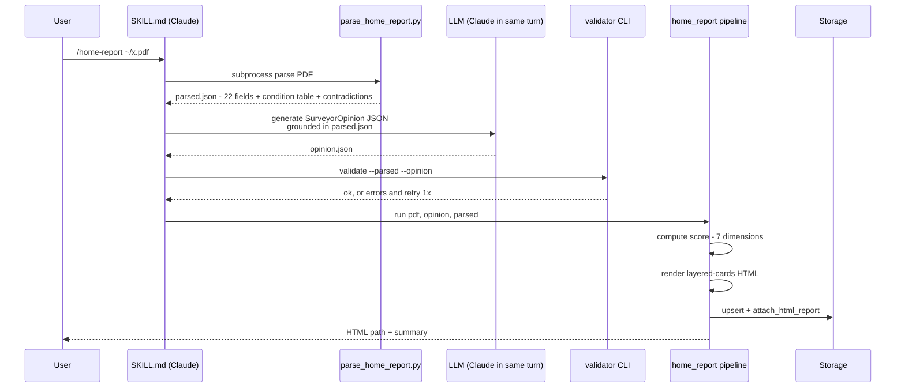

# Scottish Property Assistant

**English** · [中文](README.zh.md)

A shareable Claude Code skill suite for Edinburgh property hunting. Turns Scottish Home Report PDFs into surveyor-style analyses you can actually read and bid on.

```
/home-report ~/Downloads/your_home_report.pdf
```

→ outputs an HTML report with a senior surveyor's professional opinion (layered cards view), Victorian Tenement / Pre-1919 specific judgment, offer strategy, and viewing-day question list.

**Zero-config** — no Notion, no Gmail, no Google Maps API key required.

---

## Two commands

### `/home-report path.pdf`
**Zero-config single-PDF entry point.** Give it a Home Report PDF, get an HTML analysis. Data stored in `~/.property_data/`. Friends can clone-and-run immediately.

### `/property`
**Full workflow** (needs Notion + Gmail for the full suite; gracefully degrades when anything's missing).

```bash
/property                          # default: scan emails + list todos (dry-run)
/property --apply                  # actually write: comm entries, update viewing dates, etc.

/property prep --addr <X> ...      # pre-viewing brief for one property
/property prep --weekend           # all viewings this Sat+Sun
/property review                   # post-viewing review + gap analysis
/property compare --addr A --addr B [...]  # side-by-side comparison
/property analyze <PDF>            # = /home-report
/property emails --hours 72        # email intake only
/property health                   # connectivity check
```

Also accepts natural language ("看房 next weekend" → `prep --weekend`, "review last week" → `review`); Claude interprets intent in the SKILL.md.

---

## Architecture


### Data flow: single PDF (`/home-report path.pdf`)



See [`docs/INSTALL.md`](docs/INSTALL.md) for full install steps, [`docs/INTEGRATIONS.md`](docs/INTEGRATIONS.md) for optional Notion / Gmail / Google Maps setup, and [`docs/WITHOUT_NOTION.md`](docs/WITHOUT_NOTION.md) if you don't want to use Notion (most of the workflow still works).

---

## Install

```bash
git clone https://github.com/isaaaaabella/edinburgh-property-assistant ~/.claude/property_assistant
cd ~/.claude/property_assistant
pip install -r requirements.txt
cp .env.example .env                           # default STORAGE_BACKEND=local, no tokens needed
cp preferences.example.json preferences.json   # edit top 5 fields with your preferences
```

Symlink the two SKILLs to your Claude commands directory:
```bash
mkdir -p ~/.claude/commands
ln -s $(pwd)/skills/home-report.md ~/.claude/commands/home-report.md
ln -s $(pwd)/skills/property.md    ~/.claude/commands/property.md
```

Then in Claude Code:
```
/home-report ~/Downloads/some_home_report.pdf
```

---

## Using with other AI coding tools (Codex, Cursor, Cline, …)

The Python core is vendor-neutral — anything that can run shell commands and call an LLM can use it. Only the `skills/*.md` files are Claude Code-specific slash command format.

**Two paths**:

### Path A: hand the LLM work off, drive the CLI yourself (simplest, works with any tool)

```bash
# 1. Parse the PDF (deterministic, no LLM needed)
python parse_home_report.py ~/x.pdf > /tmp/parsed.json

# 2. Ask Codex / GPT-4 / Gemini / any LLM to read parsed.json
#    + the prompt body of skills/home-report.md, then generate an
#    opinion.json matching the schema:
python -m property_assistant.analysis.surveyor_opinion schema

# 3. Validate + run pipeline (deterministic, no LLM)
python -m property_assistant.analysis.surveyor_opinion validate \
  --parsed /tmp/parsed.json --opinion /tmp/opinion.json
python -m property_assistant.pipelines.home_report run ~/x.pdf \
  --opinion /tmp/opinion.json
```

### Path B: port the SKILL.md to your tool's prompt format

`skills/home-report.md` and `skills/property.md` use generic LLM prompting patterns (role definition / JSON schema / validate-retry loop). Copy them across, swap "you (Claude)" → "you (assistant)" etc., and they work. Codex CLI, Cursor, Continue.dev all have custom prompt mechanisms — check their docs for the exact format.

**No AI at all also works**: drive the CLI directly (step 1 + 3 above) and write `opinion.json` by hand. The validator will tell you exactly which fields are missing.

---

## Key concepts

### `SurveyorOpinion` typed contract
Surveyor opinion isn't free text — it's a 6+1 section structured object:

| Section | Content | Required |
|---|---|---|
| ① 整体定位 / Overall positioning | One-line characterisation | ✓ |
| ② 评分校正 / Score corrections | Where mechanical scoring got it wrong (all `cat_notes_contradictions` must be cited) | conditional |
| ③ 真正的关注点 / Real concerns | ≤5 most serious issues | — |
| ④ 估值判断 / Valuation judgment | HR value vs market comparables | ✓ |
| ⑤ 出价方向 / Offer direction | 1-3 strategy lines | ✓ |
| ⑥ 看房当日 3 个最关键问题 / Top 3 viewing-day questions | 1-5 items | ✓ |
| ⑦ 💭 评估师的额外思考 / Additional thoughts | Stray observations, historical patterns | optional |

Each Finding has `kind` (fact / judgment / assumption) + `text` + optional `rationale` / `quote` / `evidence_page`. The validator enforces:
- All `cat_notes_contradictions` are covered by `score_corrections`
- `fact`-kind findings must have an `evidence_page`
- At least 3 `judgment`-kind findings overall (prevents pure fact-dumping)

### HTML layered cards
- 📋 **Objective facts** (blue) — what's literally in the PDF
- 🎓 **Surveyor judgment** (green) — inferences and recommendations
- ⚠️ **Assumptions & unknowns** (yellow) — incomplete information

Below: detailed 6-section view, score correction visualisation (mechanical vs adjusted), Category 2/3 table, area intelligence, HR summary, embedded Google Maps.

### Storage abstraction
- `NotionStorage` — talks to your Notion DB "房源追踪" (Property Tracker); 34 fields with auto field-name mapping
- `LocalJSONStorage` — zero-config, stores under `~/.property_data/` (friend default)

Switch via `.env`: `STORAGE_BACKEND=notion|local`.

---

## Where data lives

| Backend | Data location | Report location |
|---|---|---|
| `local` (default) | `~/.property_data/properties/<slug>.json` | `~/.property_data/reports/<slug>/<timestamp>_<kind>.html` |
| `notion` | Notion DB "房源追踪" (one row per property) | `HTML报告` URL field (links to local `file://` path) + top-of-page callout summary |

---

## Tests

```bash
./run_tests.sh                          # full suite (storage, validators, template rendering)
NOTION_PARITY_TEST=1 ./run_tests.sh     # also run live Notion round-trip (creates + archives a test page)
```

143+ unit tests cover: PropertyRecord coercion, Notion field map, SurveyorOpinion validate, ViewingStrategy validate, PropertyRanking validate, template rendering, router subcommand parsing, end-to-end pipeline runs.

---

## Project structure

```
property_assistant/
├── core/                     # PropertyRecord, CommEntry
├── storage/                  # NotionStorage + LocalJSONStorage + factory
├── analysis/                 # surveyor_opinion, viewing_strategy, scoring, comparison
├── render/                   # renderer.py + Jinja2 templates
├── pipelines/                # home_report, viewing_prep, property_compare, intake, viewing_review
├── orchestrator/             # router.py (precise subcommand parser)
├── skills/                   # /property + /home-report SKILL.md (symlinked to ~/.claude/commands/)
├── parse_home_report.py      # deterministic PDF parser (called by pipelines)
├── fetch_emails.py           # Gmail IMAP fetcher (called by intake)
├── fetch_area_data.py        # postcodes.io + SIMD + Google Maps (optional)
├── preferences.example.json  # scoring weights + preference template (cp to preferences.json and edit)
├── legacy/                   # add_property.py / email_monitor.py (standalone tools, not in main flow)
└── tests/                    # pytest suite (143+ tests)
```

---

## Acknowledgements

Built by [@isaaaaabella](https://github.com/isaaaaabella) while house-hunting in Edinburgh's South Side. The Surveyor Opinion structure and the Scottish-housing-specific judgments were refined against real Home Reports from Marchmont, Tollcross, Newington, and Stockbridge listings (2025–2026).

Co-authored with [Claude Code](https://www.anthropic.com/claude-code) Opus 4.7 (1M context).

---

## License

MIT.
